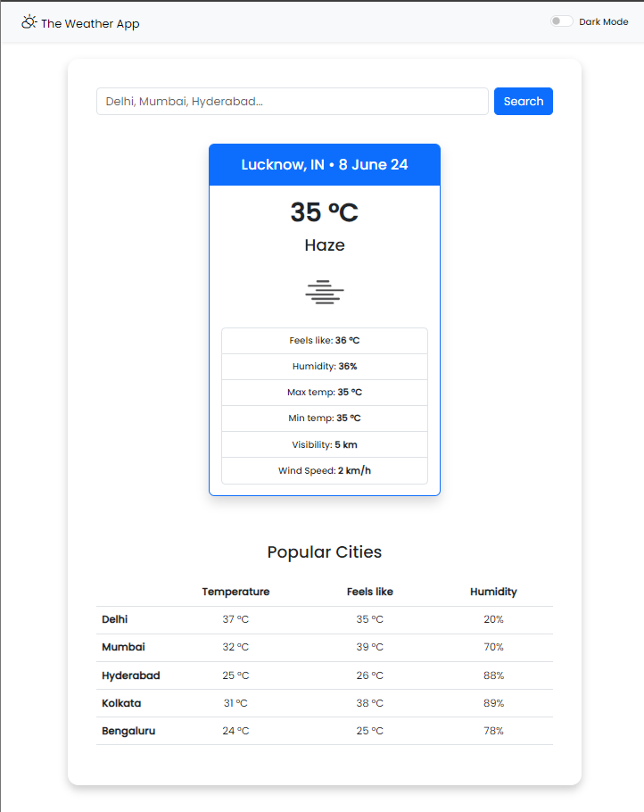
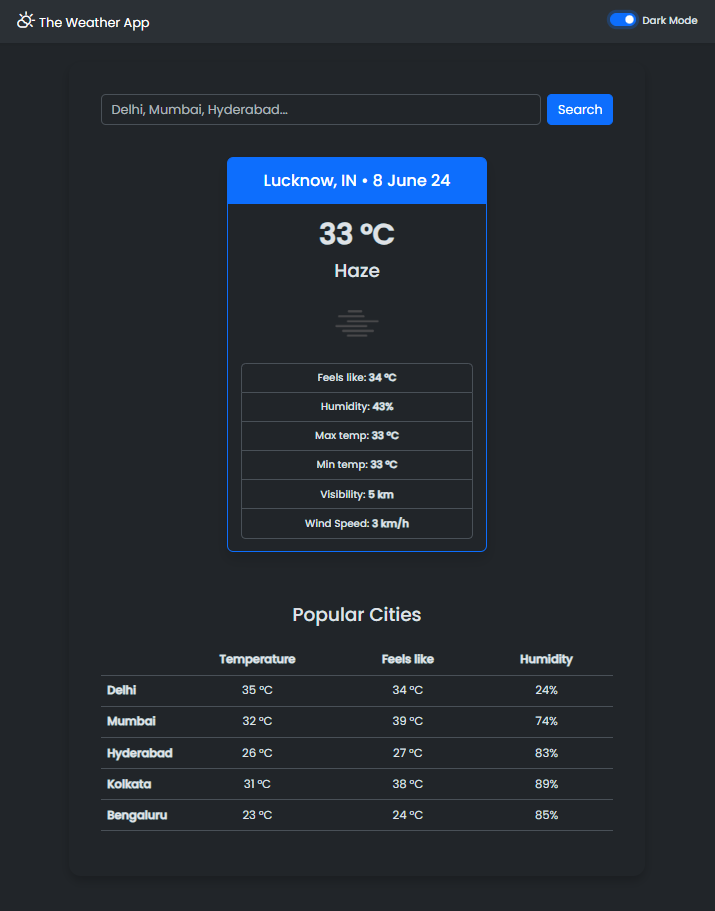

# Weather App

This is a Weather App that provides current weather information for various cities using the OpenWeather API. The application is built using HTML, CSS, JavaScript, Bootstrap, and the OpenWeather API.

# Features

1. Displays current weather information for a selected city.
2. Provides additional weather details such as temperature, humidity, visibility, and wind speed.
3. Lists weather information for popular cities.

# Technologies Used:

1. HTML: For the structure of the web pages.
2. CSS: For styling the web pages.
3. JavaScript: For handling the application logic and interacting with the OpenWeather API.
4. Bootstrap: For responsive design and styling.
5. OpenWeather API: To fetch real-time weather data.

# How to Run the Application Locally

1. Clone the repository: git clone <repository-url>
2. Navigate to the project directory: cd weather-app
3. Open the project in a code editor (optional): You can open the project in your preferred code editor to make any changes or to view the code.
4. Run the application using Live Server: Install the Live Server extension if you are using VS Code. You can install it from the Extensions Marketplace. Locate and select "Go Live" option on the index.html file.
5. Access the Weather App: Open your web browser and go to http://127.0.0.1:5500/Weather%20App/index.html (or the URL provided by Live Server) to access the Weather App.

# Approach

1. Setting up the API: Registered for the OpenWeather API and obtained the API key. Created functions to fetch weather data for a given city using the OpenWeather API.

2. Building the UI: Used HTML to create the structure of the app, including the search bar and weather display sections. Styled the app using CSS and Bootstrap for a clean and responsive design.

3. Implementing Functionality: Used JavaScript to handle user interactions, such as searching for a city. Integrated API calls to fetch and display real-time weather data. Displayed additional weather details such as temperature, humidity, visibility, and wind speed. Listed popular cities with their respective weather information.

# Screenshots

# Notes

1. Ensure you have an active internet connection as the application fetches data from the OpenWeather API.
2. The application is designed to provide real-time weather information; therefore, the accuracy of the data depends on the OpenWeather API.